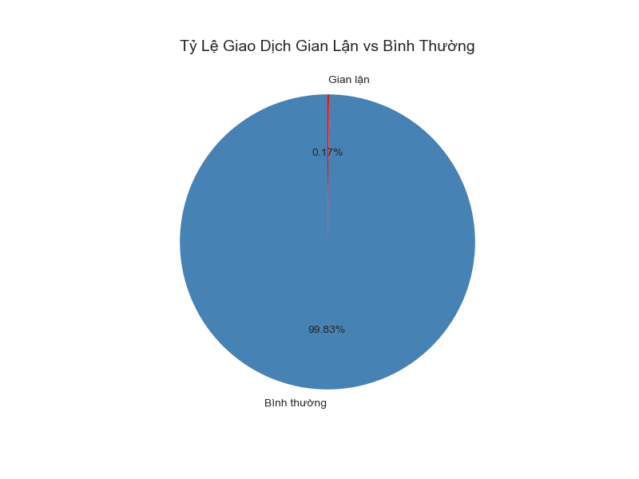
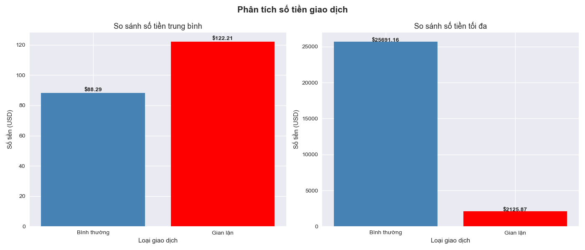
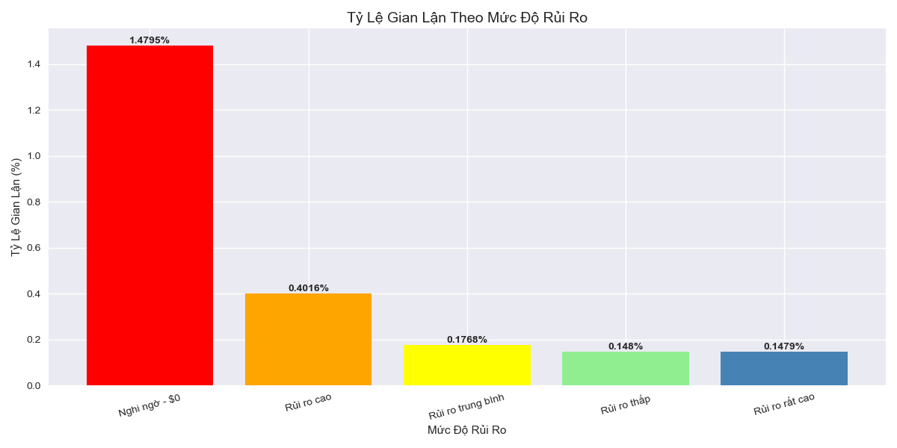

# Fintech Transaction Analysis — Phát Hiện Giao Dịch Gian Lận

# Giới thiệu
Dự án phân tích 284,807 giao dịch thẻ tín dụng thực tế
nhằm tìm ra đặc điểm và hành vi của giao dịch gian lận,
từ đó đề xuất chiến lược giám sát hiệu quả cho ngân hàng

---

# Câu hỏi phân tích
1. Tổng quan dataset trông như thế nào?
2. Có bao nhiêu giao dịch gian lận vs bình thường?
3. Số tiền giao dịch gian lận có khác bình thường không?
4. Giao dịch $0 có đáng ngờ không?
5. Phân loại giao dịch theo mức độ rủi ro như thế nào?

---

# Công cụ sử dụng
- **Python** — xử lý và phân tích data
- **SQLite** — truy vấn dữ liệu bằng SQL
- **Pandas** — làm sạch và thao tác data
- **Matplotlib** — visualize kết quả

---

# Kết quả phân tích
 1. Tỷ lệ giao dịch gian lận vs bình thường

> Gian lận chỉ chiếm 0.17%, dataset mất cân bằng nghiêm trọng

 2. So sánh số tiền giao dịch

> Số tiền TB gian lận ($122.21) cao hơn bình thường ($88.29) khoảng 38%

 3. Tỷ lệ gian lận theo mức độ rủi ro

> Giao dịch $0 có tỷ lệ gian lận cao nhất (1.48%), dấu hiệu test thẻ

---

# Insight chính

1. Gian lận chỉ chiếm 0.17% tổng giao dịch làm dataset mất cân bằng nghiêm trọng, không thể dùng accuracy đơn thuần để đánh giá

2. Số tiền trung bình giao dịch gian lận là 122.21 USD, cao hơn giao dịch bình thường 88.29 USD khoảng 38%, kẻ gian lận có xu hướng chọn số tiền vừa phải để tránh bị phát hiện

3. Có 27 giao dịch gian lận với số tiền 0 USD, đây là hành vi test thẻ trước khi thực hiện tấn công thật sự

4. Giao dịch gian lận tập trung chủ yếu ở mức 500 đến 2,000 USD, kẻ gian lận cố tình tránh số tiền quá lớn để không gây nghi ngờ
---

# Đề xuất chiến lược cho ngân hàng

1. **Cảnh báo ngay với giao dịch $0**
   - Tỷ lệ gian lận 1.48%, cao gấp 9 lần mức trung bình
   - Đây là dấu hiệu test thẻ trước khi tấn công

2. **Tăng cường giám sát nhóm $500 - $2,000**
   - Tỷ lệ gian lận 0.40%, cao thứ 2
   - Đây là vùng kẻ gian lận tập trung thực hiện

3. **Không chỉ chặn giao dịch lớn**
   - Giao dịch >$2,000 có tỷ lệ gian lận thấp nhất
   - Kẻ gian lận thông minh hơn, tránh số tiền quá lớn

4. **Theo dõi hành vi liên tiếp**
   - Pattern nguy hiểm: giao dịch $0 → giao dịch $500-$2,000
   - Cần hệ thống cảnh báo theo chuỗi hành vi

---
